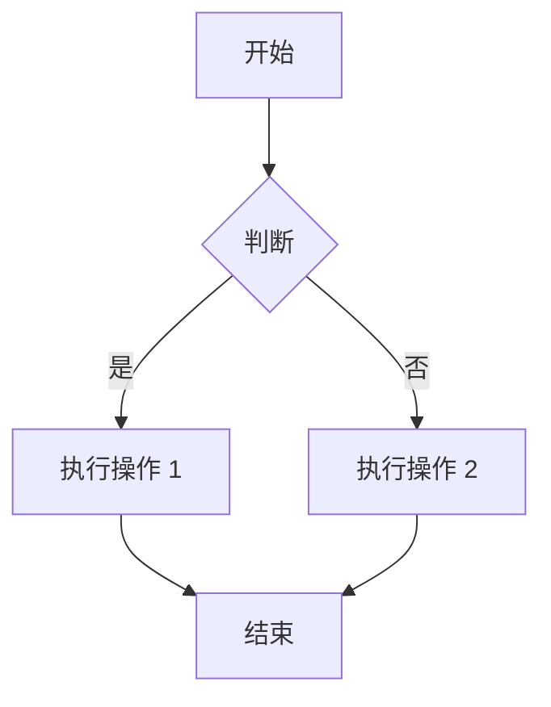
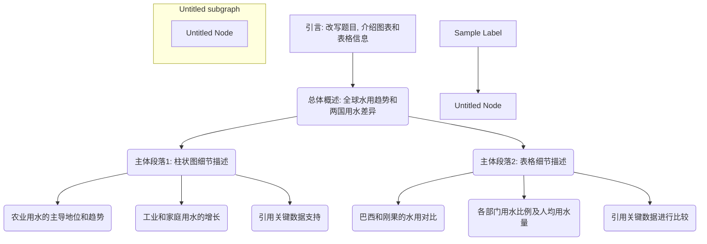
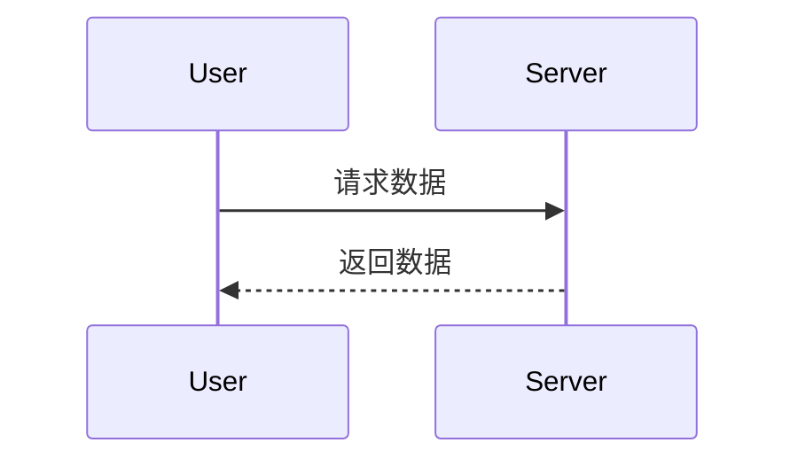

# 《人-家-企》全景测评解读报告

非常感谢您抽出宝贵时间，参与本次《人-家-企》全景测评与沙盘推演。您在整个过程中的坦诚分享与深入思考，为我们提供了一个全面而深刻的视角，让我们得以窥见您、您的家族以及贵企业三者间紧密而复杂的互动关系。
本报告旨在基于您所提供的信息，为您呈现一份客观、系统的分析与解读。我们坚信，清晰的自我认知与对现状的洞察，是开启未来成功之路的第一步。希望这份报告能成为您前行道路上的一面镜子，帮助您看清当下、规划未来。

---


## 第一部分：现状全景图——我们所看到的客观事实

通过访谈、问卷和沙盘的综合呈现，我们构建了您当前所处的“人-家-企”三维度的全景画面。

1. **关于“企”：一艘经历风浪、寻求新航向的坚实航船**
   - **坚实的基础：** 贵公司拥有32年的深厚积淀，前30年从未亏损，这本身就是一项了不起的成就。同时，通过工业地产形成的稳定现金流，为企业抵御风险、探索转型提供了坚实的“压舱石”。
   - **严峻的挑战：** 您清晰地认识到，企业正面临前所未有的压力。问卷反馈显示，您已将企业面临的转型压力视为当前最大的挑战，访谈中也详述了行业下行、客户转移等外部困境。主营业务营收腰斩的事实，说明转型的紧迫性已毋庸置疑。
   - **果决的行动：** 面对危机，企业已经开始主动求变。无论是引进专业的厂长来优化传统业务，还是成立新公司、引入新团队开拓汽车与储能新赛道，都展现了企业破局的决心与行动力。
  
2. **关于“家”：一个优势互补、承载厚望的核心引擎**
   - **互补的创始人：** 您的母亲如“开疆辟土”的老虎，行动力强，擅长对外关系；您的父亲则思维缜密，稳坐后方，精于财务与内核。这种“一攻一守”的组合是企业过去成功的关键。
   - **传承的责任：** 作为二代，您选择“接班”，并已进入公司近两年。您不仅是子女，更是企业未来的核心承载者。您的弟弟妹妹目前仍在外部发展，使得这份责任更加集中于您一身。
   - **无形的影响：** 父母强大的能力与权威，既是您的榜样，也构成了您需要面对和超越的目标。问卷反馈也揭示了您所面临的挑战之一，即难以超越父辈所建立的权威，这深刻反映了二代在传承中普遍面临的心理压力。

## 第二部分：核心洞察与解读——从现象到本质的深入分析

基于以上客观事实，我们识别出几个值得您关注的核心要点。这些要点并非评判，而是帮助您更深入理解自己内在状态与外在挑战的关键切入点。

1. **洞察一：角色定位的矛盾——“得力右臂”与“未来主帅”的张力**

这是一个非常核心的发现。在问卷反馈中，既是父母在企业管理中的重要助手，积极推动多个关键项目，展现出显著贡献；但同时她也意识到，若父母暂离公司一个月，自己尚不具备独立管理公司的能力。

   - **沙盘印证：** 这一点在您的沙盘推演中得到了完美的视觉化呈现。在“现在”与“未来”的两次摆盘中，您始终将自己放在母亲身旁**“辅助者”**的位置，而父亲则在后方担任**“总司令”**。您并未将自己置于中央指挥官的位置。
   - **解读：** 这揭示了您当前的核心角色定位——一个极其优秀的**“辅佐者”**和执行者，但尚未完全建立起作为独立“主帅”的心理认知和行动模式。您的目标是让父母退休，但这需要您从“辅佐”转变为“引领”。这个转变，是您未来5-10年最核心的课题。

## 附录

```python
print("Hello, Pandoc!")
```

> 这是一个引用块，将使用“引用”样式。


### ✅ 使用步骤（复制以上文件到同一目录）
1. 双击 `init.bat` / 运行 `./init.sh`  (注意添加运行权限)
   → 自动生成 `custom-reference.docx` 并提示你改样式。
2. 在 Word 里把样式改好并保存。
3. 把 `README.md` 换成你自己的内容。
4. 双击 `convert.bat` / 运行 `./convert.sh`  
   → 得到 `output.docx`，样式完全按你定义的来。


| Name | Addr | Phone |
| ---- | ---- | ----- |
| 张三 | 天津 | 123   |
| 李四 | 北京 | 456   |
| 王五 | 上海 | 789   |


### 列表
- 上海
  - 闵行
  - 青浦
  - 静安
- 天津
- 北京

## 图表






