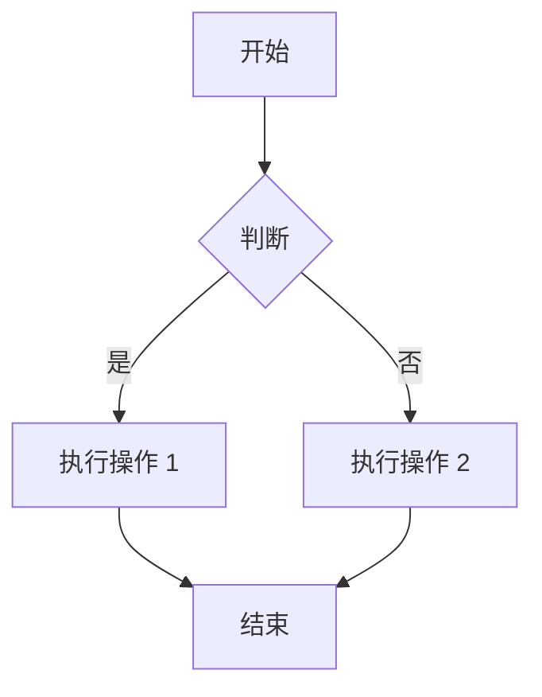
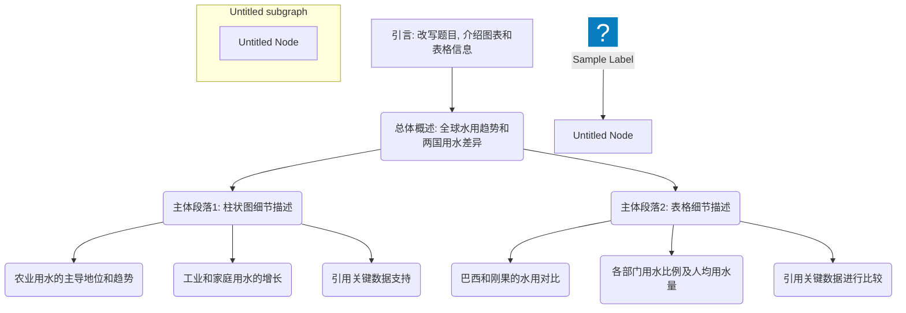
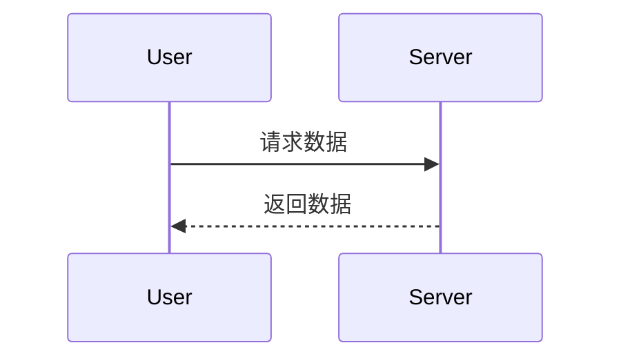

# 一级标题
[TOC]

这是正文段落，演示**样式继承**。

## 二级标题

```python
print("Hello, Pandoc!")
```

> 这是一个引用块，将使用“引用”样式。


### ✅ 使用步骤（复制以上文件到同一目录）
1. 双击 `init.bat` / 运行 `./init.sh`  (注意添加运行权限)
   → 自动生成 `custom-reference.docx` 并提示你改样式。
2. 在 Word 里把样式改好并保存。
3. 把 `README.md` 换成你自己的内容。
4. 双击 `convert.bat` / 运行 `./convert.sh`  
   → 得到 `output.docx`，样式完全按你定义的来。


| Name | Addr | Phone |
| ---- | ---- | ----- |
| 张三 | 天津 | 123   |
| 李四 | 北京 | 456   |
| 王五 | 上海 | 789   |


### 列表
- 上海
  - 闵行
  - 青浦
  - 静安
- 天津
- 北京

## 图表






