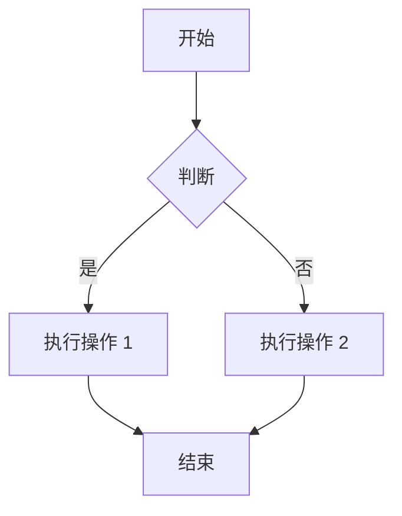
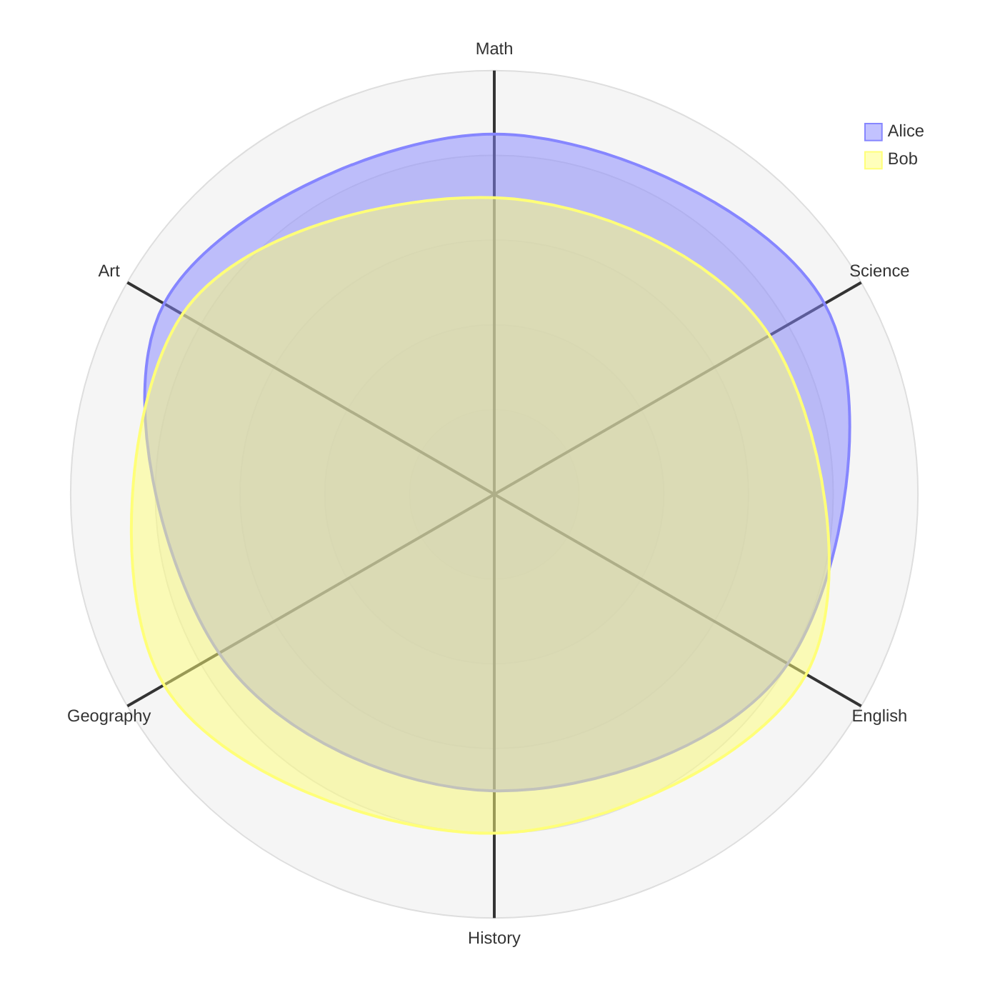
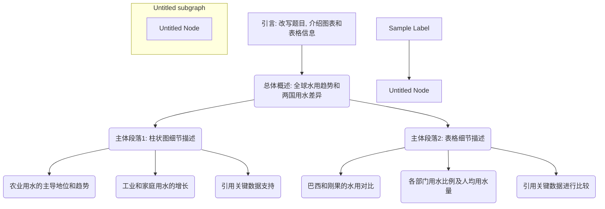
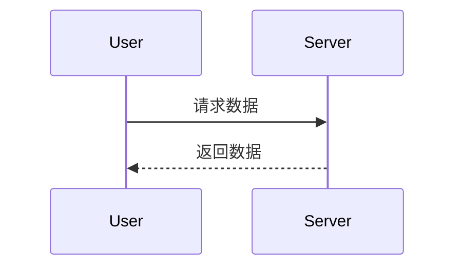

## 《人-家-企》全景测评解读报告

非常感谢您抽出宝贵时间，完成我们的《人-家-企 测评之 “家”：二代传承30问》。这份问卷不仅是数据的集合，更是您对自身现状、未来期许以及传承挑战的一次深度思考的呈现。

本报告旨在为您提供一面专业的“镜子”，客观呈现您在传承道路上的优势、潜在挑战以及关键成长点。我们的角色是您的专业伙伴，基于您提供的“事实”，与您共同探讨从“优秀”迈向“卓越”的最佳路径。我们深信，通过这次深度的自我审视，您将能更清晰地规划未来的传承之路。

---

### **第一部分：核心优势与积极信号——您已具备的坚实基础**

在深入分析之前，我们首先从问卷中看到了您在接班道路上已经具备的几项关键优势，这是您未来成功传承的宝贵资产：

1.  **接班意愿坚定，目标明确 (Q2):** 您明确选择“接班”，这体现了您对家族企业的责任感与使命感。一个清晰的目标是开启并坚持这段充满挑战的旅程的首要前提。

2.  **代际沟通基础良好 (Q4, Q9, Q22):** 您认为可以与父亲/母亲保持“持续且良好的沟通”，并且能够“理解”他们的决策，遇到难题时也“会主动商量”。这是传承过程中最为宝贵的“润滑剂”，为解决未来可能出现的分歧与冲突奠定了坚实的基础。

3.  **传承者的“老虎”特质 (Q7):** 您将自己定义为与父辈一样的“老虎型”领导者，这代表了您内在拥有开疆辟土、坚决果敢的驱动力与企图心。这种积极进取的精神是引领企业在未来市场中搏击风浪的关键特质。

4.  **清醒的自我认知与责任感 (Q8, Q16):** 您坦诚地认为自己目前尚“不具备”完全接班的能力，并且“不愿意”看到家族企业在他人手中经营不善。这表明您对“接班”二字怀有深刻的敬畏之心，既不高估自己，也对家族的未来怀有强烈的责任感。

**小结：** 叶先生，您已经拥有了成功接班者所必需的“心”——责任心、进取心与敬畏心，以及良好的沟通基础。这让我们相信，您具备巨大的潜力，能够成为家族企业当之无愧的“顶梁柱”。

---

### **第二部分：核心挑战与成长洞察——通往卓越的“最后一公里”**

基于“诊断医生”的原则，我们识别出您问卷中几个关键的“认知矛盾点”。这些矛盾点并非问题，而是您内心纠结、现实与期望存在差距的真实反映，它们恰恰是我们能为您提供精准支持、助您突破瓶颈的最佳切入点。

#### **洞察一：“虎父”与“虎子”的传承困境：权威如何共存与交渡？**

这是一个非常典型的、贯穿您问卷的核心矛盾。

*   **矛盾呈现：**
    *   您认为自己是“老虎型”（Q7），是父亲的“得力左膀右臂”（Q13）。
    *   但同时，您感觉在工作中“事事被过问、不放心”（Q23），并且认为自己“不是”被认为工作积极热情主动的人（Q11），也无法在父亲离开一个月时独立管好公司（Q14）。

*   **专业诊断：**
    这是典型的“两只老虎”在同一个“山头”的动态博弈。父辈的“老虎”本能是掌控与决断，这体现为您感受到的“不放心”与“事事过问”。而作为“小老虎”的您，虽然有强大的内驱力，但在父辈强大的权威之下，您的行动空间与自主性受到限制，导致您的“积极主动”难以被充分看见和认可。您认为自己是“左膀右臂”，这更多是“执行”层面的得力；但距离独立“当家”，还存在信任与授权的鸿沟。

*   **服务切入点：**
    这个困境的核心并非能力问题，而是**“权力-责任-信任”**的平衡问题。我们的**《跨代领导力：从“被看着长大”到“引领团队”》**课程与**一对一教练服务**，可以精准地帮助您：
    1.  建立与父辈在“老虎型”人格基础上的新型沟通模式。
    2.  学习向上管理，主动争取并“拿”到信任和授权。
    3.  找到自己作为“二代老虎”的独特领导力风格，而不是成为父辈的影子。

#### **洞察二：理想抱负与现实路径的差距：如何将10年迷茫变为3年清晰？**

您对接班的未来充满了期待，但也感受到了巨大的压力与不确定性。

*   **矛盾呈现：**
    *   您“希望并相信自己能引领企业的变革创新”（Q28）。
    *   但同时，您对企业未来发展“持中立态度”（Q29），为自己的未来感到“迷茫”（Q25），并预估自己独立接班需要“10年”（Q3），摘掉父辈光环需要“10年以上”（Q31）。

*   **专业诊断：**
    这组矛盾深刻地揭示了您**“有雄心，但缺地图”**的现状。您渴望带领企业转型（最急迫的挑战是“公司转型压力”，Q18），但对如何实现这一目标缺乏清晰、可行的路径规划，导致了“中立”和“迷茫”的观望心态。长达“10年”的预估，反映的不是您缺乏信心，而是您预见到这条路上的荆棘密布，感觉需要漫长的时间去独自摸索。

*   **服务切入点：**
    您最需要的不是“鸡汤”，而是一份清晰的**“接班作战地图”**。我们的核心服务恰好能解决这个问题：
    1.  **《接班全局规划：定战略、找切入、促行动》**：帮您将10年的模糊想象，转化为一个3-5年的、分阶段的、可落地的行动方案。
    2.  **《弯道超车：拓展企业第二增长曲线》**：为您最关心的“公司转型压力”问题，提供系统性的战略工具和方法论，让“创新”不再是口号，而是可执行的项目。

#### **洞察三：从“独行者”到“领导者”的蜕变：谁是您身边的“解忧人”？**

领导力的提升是您最迫切的需求，而这份问卷也反映出您在成长路上的孤独。

*   **矛盾呈现：**
    *   您认为接班最急需提升的能力是“领导力”（Q20），同时还勾选了领导力相关的几乎所有能力项（创新、战略、情商、决策）。
    *   但当您碰到接班困扰时，身边却“没有”可以为您解忧的人（Q15）。

*   **专业诊断：**
    这表明您深刻地意识到了自己的能力短板，但正处于一个**“高处不胜寒”的孤立境地**。在公司，您是“少主”，难以与下属推心置腹；在家里，与父辈的沟通可能更多是关于业务，而非个人困惑与成长。领导力的提升，尤其是在家族企业中处理复杂人际关系、影响元老、建立自己团队的能力，无法仅通过学习获得，更需要在安全的环境下进行演练、复盘和获得专业反馈。

*   **服务切入点：**
    我们存在的价值，就是成为您身边最专业、最可靠的“解忧人”和“陪练员”。
    1.  **一对一高管教练服务**：为您提供一个绝对保密和安全的对话空间，针对您在领导力（如影响元老、激励团队、处理冲突）上遇到的实际问题，提供个性化的解决方案和实战演练。
    2.  **《识人用人的底线思维与防损之道》**与**《政-商-家场景精准表达》**等课程，将为您提供具体、实用的领导力工具箱。

---

### **第三部分：核心结论与发展建议**

综合以上分析，叶先生，您正处在从一个优秀的“执行者”向一个卓越的“领导者”和“掌舵人”蜕变的关键时期。挑战与机遇并存。我们建议您从以下三个层面系统性地推进您的接班进程：

1.  **明确路径：绘制您的专属接班蓝图。**
    *   **目标：** 解决迷茫感，将10年的漫长预估，缩短为有计划、有步骤的行动。
    *   **行动：** 参与《接班全局规划》工作坊，系统梳理企业现状、家族期望与个人志向，确立您在传承过程中的切入点、关键里程碑与资源需求。

2.  **构建能力：聚焦领导力的实战提升。**
    *   **目标：** 解决领导力瓶颈，建立个人权威，真正成为团队的核心。
    *   **行动：** 启动一对一教练计划，结合《跨代领导力》等主题课程，在真实的工作场景中“边学边练”，将知识转化为能力。

3.  **优化环境：构建新型的代际协作关系。**
    *   **目标：** 解决“两虎共存”的困境，从被动的“被过问”转变为主动的“共决策”。
    *   **行动：** 在我们的引导下，与父辈进行一次高质量的“传承对话”，明确双方的角色、权责与期望，建立定期的沟通与决策复盘机制。

---

您的问卷展现了一个有抱负、有反思、有担当的青年企业家的真实画像。您所面临的挑战，是几乎每一位二代传承者都会遇到的共性问题。幸运的是，这些问题都有专业的路径可以解决。

我们非常期待能与您进行一次一对一的深度交流，详细解读这份报告，并倾听您的想法，共同探讨最适合您的下一步行动方案。

再次感谢您的信任！

## 附录

```python
print("Hello, Pandoc!")
```

> 这是一个引用块，将使用“引用”样式。


### ✅ 使用步骤（复制以上文件到同一目录）
1. 把 `README.md` 换成你自己的内容。
2. 双击 `convert-pdf.bat` / 运行 `./convert-pdf.sh`  
   → 得到 `output.pdf`，样式完全按你定义的来。


### 表格

| Name | Addr | Phone |
| ---- | ---- | ----- |
| 张三 | 天津 | 123   |
| 李四 | 北京 | 456   |
| 王五 | 上海 | 789   |


### 列表
- 上海
  - 闵行
  - 青浦
  - 静安
- 天津
- 北京

### 图表









